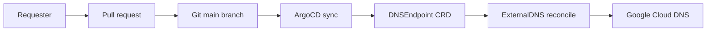
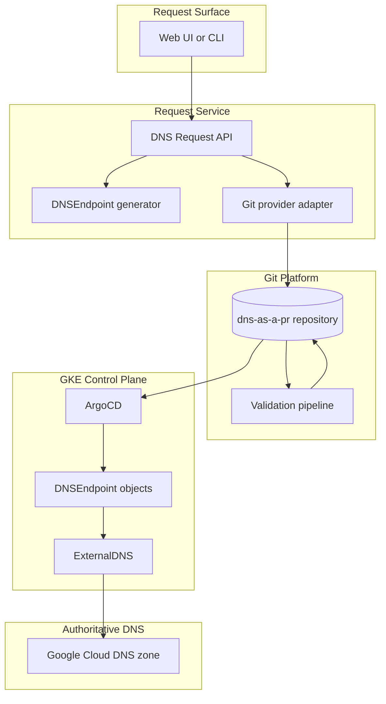
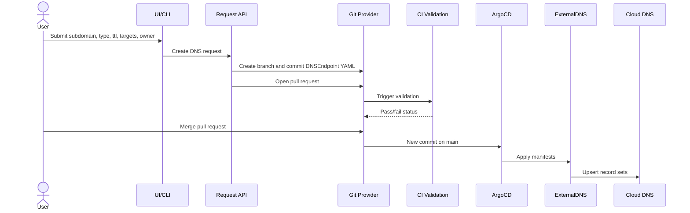

# dns-as-a-pr

`dns-as-a-pr` is a small GitOps DNS registry for `simardeep.xyz`.

The contract is simple: a DNS change is a pull request. After the request is merged, ArgoCD applies the `DNSEndpoint` manifest to the GKE control-plane cluster and ExternalDNS reconciles it into Google Cloud DNS. No service account keys, no manual DNS console work after merge.



## Architecture

This platform keeps a narrow responsibility boundary: request and review DNS in Git, then let GitOps and controllers reconcile state.



### Request Lifecycle



## What This Runs

| Layer | Choice | Purpose |
|---|---|---|
| Infrastructure | OpenTofu | Creates GKE, Cloud DNS, IAM, and Workload Identity bindings. |
| GitOps | ArgoCD | Continuously applies this repo to the cluster. |
| DNS controller | ExternalDNS | Reads `DNSEndpoint` objects and writes Cloud DNS records. |
| Validation | yamllint + kubeconform | Keeps PRs structurally correct without a policy engine. |

The cluster is intentionally a control plane only. It does not host application traffic.

GitHub is the current host, not a platform requirement. The reusable scripts in `scripts/` are the validation contract; GitHub Actions are only wrappers around those scripts. Azure DevOps can call the same scripts later.

## Repository Layout

```text
.
|-- dns-records/          # User-facing DNS records; each .yaml is a DNSEndpoint
|-- infra/                # OpenTofu modules and poc environment
|-- k8s/                  # ArgoCD bootstrap and ordered platform manifests
|-- schemas/              # Local JSON schemas for CI validation
|-- scripts/              # Portable validation, generation, and e2e scripts
`-- README.md             # Product, operator, and contributor guide
```

## DNS Record Contract

All records live in `dns-records/` and must use this shape:

```yaml
apiVersion: externaldns.k8s.io/v1alpha1
kind: DNSEndpoint
metadata:
  name: blog-simardeep-xyz
  namespace: dns
  labels:
    simardeep.xyz/owner: "your-name-or-team"
spec:
  endpoints:
    - dnsName: blog.simardeep.xyz
      recordType: A
      recordTTL: 300
      targets:
        - 203.0.113.10
```

Supported record types are `A`, `AAAA`, `CNAME`, `TXT`, and `NS`.

Use `NS` when you want to delegate a whole subdomain to another authoritative zone:

```yaml
apiVersion: externaldns.k8s.io/v1alpha1
kind: DNSEndpoint
metadata:
  name: project-simardeep-xyz
  namespace: dns
  labels:
    simardeep.xyz/owner: "your-name-or-team"
spec:
  endpoints:
    - dnsName: project.simardeep.xyz
      recordType: NS
      recordTTL: 300
      targets:
        - ns-cloud-a1.googledomains.com
        - ns-cloud-a2.googledomains.com
        - ns-cloud-a3.googledomains.com
        - ns-cloud-a4.googledomains.com
```

## Add Or Change DNS

1. Copy `dns-records/_template.yaml.txt`.
2. Save it as `dns-records/<subdomain>.simardeep.xyz.yaml`.
3. Set `metadata.name`, `metadata.labels.simardeep.xyz/owner`, `dnsName`, `recordType`, `recordTTL`, and `targets`.
4. Open a pull request.
5. Wait for GitHub Actions to pass.
6. Merge the PR.
7. ArgoCD and ExternalDNS reconcile the record automatically.

Verify from your workstation:

```bash
dig +short <subdomain>.simardeep.xyz A
dig +short <subdomain>.simardeep.xyz TXT
dig +short <subdomain>.simardeep.xyz NS
```

You can also generate the YAML from the command line. This is the same flow a future UI should call behind the scenes:

```bash
scripts/new-dns-record.sh \
  --subdomain blog \
  --type A \
  --target 203.0.113.10 \
  --owner platform
```

## Bootstrap The Platform

Prerequisites:

1. GCP project: `edip-aurora-fgc`
2. Domain: `simardeep.xyz`
3. Local tools: `gcloud`, `kubectl`, `tofu`

Create the OpenTofu state bucket once:

```bash
gcloud storage buckets create gs://edip-aurora-fgc-tofu-state \
  --project=edip-aurora-fgc \
  --location=northamerica-northeast1 \
  --uniform-bucket-level-access
```

Provision GKE, Cloud DNS, and IAM:

```bash
cd infra/envs/poc
tofu init
tofu apply -var "authorized_cidr=<YOUR_PUBLIC_IPV4>/32"
tofu output -json name_servers
```

Set the `simardeep.xyz` nameservers in Namecheap to the Cloud DNS nameservers from `tofu output`.

Bootstrap ArgoCD once:

```bash
gcloud container clusters get-credentials dns-as-a-pr \
  --region northamerica-northeast1 \
  --project edip-aurora-fgc

kubectl create namespace argocd
kubectl apply -n argocd -f https://raw.githubusercontent.com/argoproj/argo-cd/v2.12.6/manifests/install.yaml
kubectl apply -f k8s/bootstrap/root-app.yaml
```

After that, ArgoCD owns the platform from Git.

## Validate Locally

```bash
scripts/validate-dns.sh
scripts/validate-k8s.sh
scripts/validate-infra.sh
```

## End-To-End Test

Run the live DNS test from the repo root:

```bash
./scripts/e2e-dns.sh
```

The test verifies:

1. ArgoCD apps are synced and healthy.
2. `DNSEndpoint` objects exist in the `dns` namespace.
3. ExternalDNS is running with the expected CRD source, domain filter, public-zone filter, and record type flags.
4. Cloud DNS has the expected A, TXT, NS, and ownership TXT records.
5. Authoritative Cloud DNS nameservers resolve the records.

## Operations

Check ArgoCD:

```bash
kubectl -n argocd get applications
```

Check ExternalDNS:

```bash
kubectl -n external-dns get pods
kubectl -n external-dns logs deploy/external-dns --tail=100
```

Check records in Cloud DNS:

```bash
gcloud dns record-sets list --zone simardeep-xyz --project edip-aurora-fgc
```

ExternalDNS-managed records have ownership TXT records prefixed with `edns-`.

## Security Model

1. GCP auth uses Workload Identity. There are no service account keys.
2. ExternalDNS writes only through the dedicated Google service account.
3. DNS changes are reviewed through GitHub pull requests and `CODEOWNERS`.
4. ExternalDNS is scoped to `simardeep.xyz` and public Cloud DNS zones.

## Future UI

A UI makes sense, but it should stay thin. It should ask for subdomain, record type, TTL, owner, and targets, generate the same `DNSEndpoint` YAML as `scripts/new-dns-record.sh`, and open a pull request through a pluggable Git provider.

```text
UI form -> generate YAML -> create branch -> open pull request -> CI -> merge -> ArgoCD -> ExternalDNS
```

The UI should never write Cloud DNS directly and should not talk to GCP. Git remains the source of truth.

The provider seam should be small:

```text
GitProvider.createBranch()
GitProvider.upsertFile()
GitProvider.openPullRequest()
```

A concrete interface shape for the UI backend:

```ts
export type RecordType = "A" | "AAAA" | "CNAME" | "TXT" | "NS";

export interface DnsRequest {
  subdomain: string;
  zone: "simardeep.xyz";
  recordType: RecordType;
  recordTTL: number;
  targets: string[];
  owner: string;
}

export interface GitProvider {
  createBranch(input: { baseBranch: string; newBranch: string }): Promise<void>;
  upsertFile(input: {
    branch: string;
    path: string;
    content: string;
    message: string;
  }): Promise<void>;
  openPullRequest(input: {
    branch: string;
    baseBranch: string;
    title: string;
    body: string;
  }): Promise<{ url: string }>;
}
```

If you want a draw.io-style visual artifact, keep Mermaid in this README as the source of truth and export the same diagrams to `docs/architecture.drawio` during release prep.

Today that provider can be GitHub. Later it can be Azure DevOps without changing the DNS registry, manifests, validation scripts, or ArgoCD/ExternalDNS flow.
