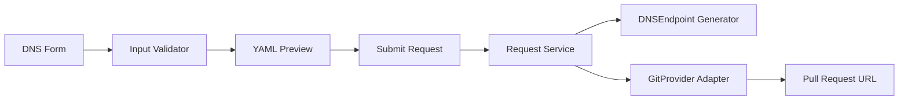

# UI Architecture (Thin PR Generator)

## Product Boundary

The UI is a request layer only. It does not mutate Cloud DNS directly and does not talk to GCP APIs.

1. Capture DNS request input.
2. Generate a valid `DNSEndpoint` manifest.
3. Open a pull request in the Git host.

## Components



## Input Contract

```json
{
  "subdomain": "blog",
  "zone": "simardeep.xyz",
  "recordType": "A",
  "recordTTL": 300,
  "targets": ["203.0.113.10"],
  "owner": "platform"
}
```

Validation rules:

- `subdomain` is required and lower-case DNS-safe.
- `recordType` must be one of `A`, `AAAA`, `CNAME`, `TXT`, `NS`.
- `recordTTL` must be a positive integer.
- `targets` must contain at least one non-empty value.
- `owner` is required for ownership traceability.

## Output Path

- File path template: `dns-records/<subdomain>.simardeep.xyz.yaml`
- Branch template: `dns-request/<subdomain>-<timestamp>`
- PR base branch: `main`

## Provider Portability

The service owns business logic. Git providers only implement branch/file/PR primitives.

```ts
export interface GitProvider {
  createBranch(input: { baseBranch: string; newBranch: string }): Promise<void>;
  upsertFile(input: {
    branch: string;
    path: string;
    content: string;
    message: string;
  }): Promise<void>;
  openPullRequest(input: {
    branch: string;
    baseBranch: string;
    title: string;
    body: string;
  }): Promise<{ url: string }>;
}
```

Implementations:

- `github` adapter (first)
- `azure-devops` adapter (later)

No other platform code changes should be required for migration.
